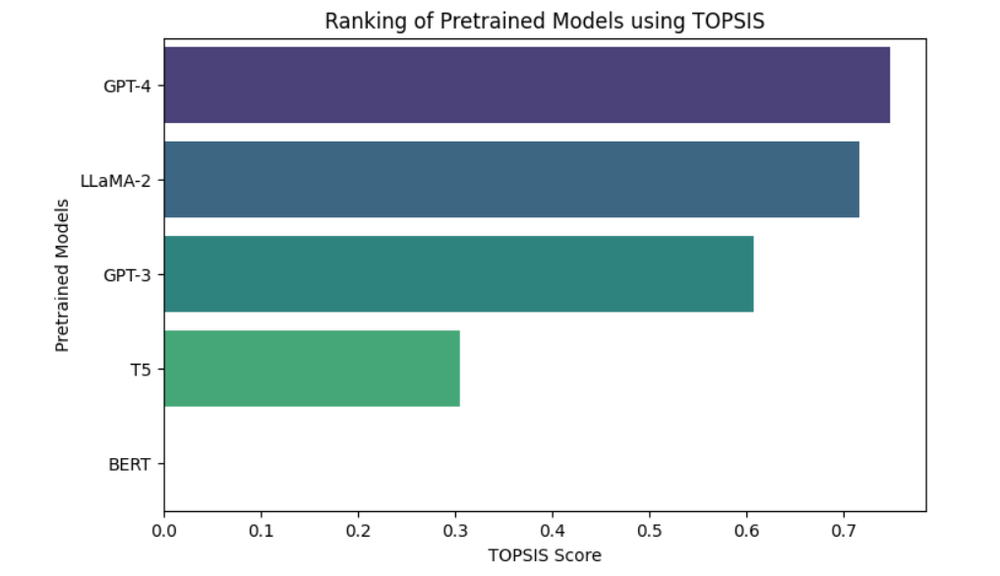

# TOPSIS-Based Evaluation of Pretrained Text Generation Models

### Overview

This project implements the TOPSIS (Technique for Order of Preference by Similarity to Ideal Solution) method to rank pretrained text generation models based on multiple evaluation criteria. The approach helps identify the best model by considering various performance metrics.

## Performance Metrics Considered
#### Performance Metrics Considered
#### BLEU Score (Higher is better)
#### ROUGE Score (Higher is better)
#### Perplexity (Lower is better)
#### Generation Speed (tokens/sec) (Higher is better)

### Dataset

The project evaluates five well-known pretrained models:

GPT-3

GPT-4

LLaMA-2

BERT

T5

## Performance Metrics

| Model   | BLEU Score | ROUGE Score | Perplexity | Speed (tokens/sec) |
|---------|-----------|-------------|------------|---------------------|
| GPT-3   | 0.78      | 0.76        | 20         | 30                  |
| GPT-4   | 0.85      | 0.88        | 15         | 25                  |
| LLaMA-2 | 0.82      | 0.81        | 18         | 28                  |
| BERT    | 0.75      | 0.72        | 25         | 20                  |
| T5      | 0.79      | 0.77        | 22         | 23                  |

## Ranked Models Based on TOPSIS
The models are ranked based on their TOPSIS scores.

| Rank | Model   | TOPSIS Score |
|------|--------|--------------|
| 1️  | GPT-4  | 0.152018        |
| 2️  | LLaMA-2 | 0.138493      |
| 3️  | GPT-3  | 0.130805       |
| 4️  | T5     | 0.098388        |
| 5️  | BERT   | 0.075339        |

## 📉 Visualization

## Conclusion
GPT-4 ranked the highest using the TOPSIS method based on the given evaluation criteria. This approach helps in selecting the best model based on multiple performance metrics.
